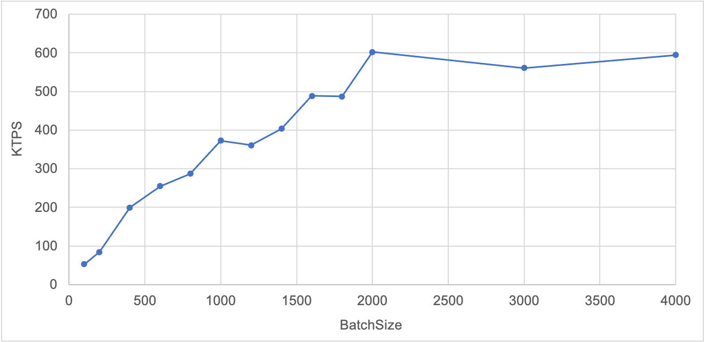

Kafka-Client
===

Analyze ledger files for blockchain including hyperledger fabric v1.x and v2.x.

## Features

* List existing topics;
* Get the latest offset of a given topic;
* Fill a kafka topic with numbers of messages.

## Installation

### Use Docker (Recommended)

Compile and create a `kafka-client` docker image for quick usage.

```bash
$ make docker
$ docker run --rm -it kafka-client help
```

### Local build

In order to build locally, you need to install `Go 1.12+`, and then run

```bash
$ make mod build
$ ./kafka-client help
```

## Usage

```bash
$ kafka-client help
kafka-client helps you to interact with kafka efficiently, including list topic, get offset or send messages

Usage:
  kafka-client [command]

Available Commands:
  getOffset   Get the last offset in the topic
  help        Help about any command
  listTopics  List the existing topics at the broker
  sendMsg     Send messages to the kafka topic
  version     Print the version number

Flags:
      --config string      config file (default is $HOME/.kafka-client.yaml)
  -h, --help               help for kafka-client
      --kafka-url string   The kafka broker URL to connect with. (default "localhost:9092")
  -t, --toggle             kafka-client is an efficient client to interact with kafka cluster

Use "kafka-client [command] --help" for more information about a command.
```

### List Topics

```bash
./kafka-client listTopics --help
List the existing topics at the broker

Usage:
  kafka-client listTopics [flags]

Flags:
  -h, --help   help for listTopics

Global Flags:
      --config string      config file (default is $HOME/.kafka-client.yaml)
      --kafka-url string   The kafka broker URL to connect with. (default "localhost:9092")
```

### Get Offset of a Topic

```bash
./kafka-client getOffset --help
Get the last offset in the topic

Usage:
  kafka-client getOffset [flags]

Flags:
  -h, --help           help for getOffset
      --topic string   The kafka topic to check the offset. (default "test")

Global Flags:
      --config string      config file (default is $HOME/.kafka-client.yaml)
      --kafka-url string   The kafka broker URL to connect with. (default "localhost:9092")
```

### Send Messages to a Topic

```bash
./kafka-client sendMsg --help
Send given numbers of messages with given batch-size to the kakfa topic

Usage:
  kafka-client sendMsg [flags]

Flags:
      --batch-size int   Size of batch to send. (default 1000)
  -h, --help             help for sendMsg
      --num-msg int      Number of messages to send. (default 1000)
      --topic string     The kafka topic to send messages to. (default "test")

Global Flags:
      --config string      config file (default is $HOME/.kafka-client.yaml)
      --kafka-url string   The kafka broker URL to connect with. (default "localhost:9092")
```

## Tutorial

### Setup kafka env

Ignore this step if the kafka env is ready.

Create a kafka cluster with 3 brokers.

```bash
$ git clone github.com/yeasy/docker-compose-files && cd docker-compose-files/kafka
$ make restart
```

Then start a golang container to connect to the kakfa network, and map this kafka client into it.

```bash
$ git clone github.com/yeasy/kafka-client && cd kafka-client
$ docker run --net kafka_default -it -v $PWD:/go/kafka-client golang:1.14 bash
```

The kakfa-client will be at the `/go/kafka-client` path inside the container.

### List Topics

List the existing topics at the broker.

```bash
make test-listTopics
go build -o kafka-client main.go
./kafka-client listTopics \
        --kafka-url "kafka0:9092"
1 topics: [test]
INFO[0000] Execution time is 52.4489ms
```

### Get Offset of a topic

Get the last offset of a topic.

```bash
$ make test-getOffset
go build -o kafka-client main.go
./kafka-client getOffset \
        --kafka-url "kafka0:9092" \
        --topic "test"
Topic test's offset = 2121000
INFO[0000] Execution time is 79.7857ms
```

### Send Messages

Send 1000,000 messages to the kakfa topic with hundreds of KTPS).

```bash
$ make test-sendMsg
go build -o kafka-client main.go
./kafka-client sendMsg \
        --kafka-url "kafka0:9092" \
        --topic "test" \
        --num-msg 1000000 \
        --batch-size 1000
INFO[0000] Before sending messages, the last offset = 0
INFO[0002] After sending 1000000 messages, the last offset = 1000000
INFO[0002] Execution time is 2.7932098s
```

Following figure shows the sending performance with various batch-size.



### Create Docker image

```bash
make docker
```

### Test

```bash
make test
```

### Run Linters

```bash
make linter
```
### Update and vendor dependencies

```bash
make mod
```
